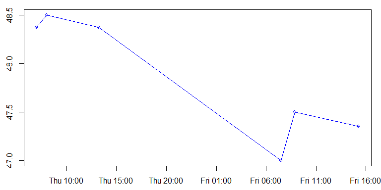

<!-- README.md is generated from README.Rmd. Please edit that file -->
### Introduction

An Unevenly-spaced Time Series (uts) is a sequence of observation time and value pairs (t<sub>n</sub>, X<sub>n</sub>) with strictly increasing observation times. As opposed to equally spaced time series, the spacing of observation times may not be constant.

As of early 2018, to the best of my knowledge, there is no `R` time series package that allows to write 100% of the application logic in terms of this definition. Either directly or indirectly, existing implementations fall back on equally spaced data for some of their functionality. For example, the window width of a rolling time series operator, such as a moving average, is usually specified in terms of the number of observations (e.g. 7 observations) instead of a temporal duration (e.g. 6 hours).

Even when a time series is equally spaced, it is often preferable to define operations using a temporal duration (e.g. a moving average over the past year) instead of number of observations (e.g. a moving average over the last 12 observations values). Should the frequency of the time series change, then in the former case the code would not require any changes, while it would in the later case. Moreover, in this way an identical analysis can be carried out on multiple time series of different frequencies, without having to keep track of the individual observation frequencies.

I therefore decided to design a new time series package, partially based on my [research](http://www.eckner.com/research.html) on this topic.

### Advantages

-   100% of the application logic can be written in terms of temporal durations (as opposed to number of observations).
-   Individual time series can store arbitrary `R` objects (not just numbers).
-   Add-on packages provide novel functionality:
-   utsData: example data sets
-   utsMultivariate: time series vectors and matrices
    -   These objects can be manipulated like normal R vectors and matrices, but with one extra dimension representing time.
    -   The individual time series are completely independent of each other. In particular, the observation times do not need to be synchronized.
-   utsOperators: moving averages and other rolling time series operators
-   utsTrendSeasonality: trend and seasonality estimation

### Installation

This package is not yet available on CRAN, but can be installled from GitHub:

``` r
devtools::install_github("andreas50/uts")   # using package 'devtools'
remotes::install_github("andreas50/uts")    # ... or using package 'remotes'
```

### Sample Code

``` r
# Get sample unevenly-spaced time series with six observations
x <- ex_uts()
x
#> 2007-11-08 07:00:00 2007-11-08 08:01:00 2007-11-08 13:15:00 2007-11-09 07:30:00 2007-11-09 08:51:00 
#>              48.375              48.500              48.375              47.000              47.500 
#> 2007-11-09 15:15:00 
#>              47.350
```

``` r
# Plot the time series
plot(x, type="o", cex=0.8)
```



``` r
# Get first and last observation value(!)
first(x); last(x)
#> [1] 48.375
#> [1] 47.35

# Get the first and last observation time(!)
start(x); end(x)
#> [1] "2007-11-08 07:00:00 EST"
#> [1] "2007-11-09 15:15:00 EST"

# Get time series length, first in terms of number of observations, second in terms of temporal length
length(x); length_t(x)
#> [1] 6
#> [1] "116100s (~1.34 days)"

# Insert new observation
x[as.POSIXct("2007-11-10 10:00:00")] <- 45

# Get most recent observation at specific time point
sample_values(x, as.POSIXct("2007-11-10"))
#> [1] 47.35

# Shift observation times by 3 hours
lag_t(x, dhours(3))
#> 2007-11-08 10:00:00 2007-11-08 11:01:00 2007-11-08 16:15:00 2007-11-09 10:30:00 2007-11-09 11:51:00 
#>              48.375              48.500              48.375              47.000              47.500 
#> 2007-11-09 18:15:00 2007-11-10 13:00:00 
#>              47.350              45.000

# Get maximum observation value and the corresponding time
max(x); which.max(x)
#> [1] 48.5
#> [1] "2007-11-08 08:01:00 EST"

# Time series arithmetic
x*2 + 5
#> 2007-11-08 07:00:00 2007-11-08 08:01:00 2007-11-08 13:15:00 2007-11-09 07:30:00 2007-11-09 08:51:00 
#>              101.75              102.00              101.75               99.00              100.00 
#> 2007-11-09 15:15:00 2007-11-10 10:00:00 
#>               99.70               95.00

# Convert time series to data.frame
as.data.frame(x)
#>                  time  value
#> 1 2007-11-08 07:00:00 48.375
#> 2 2007-11-08 08:01:00 48.500
#> 3 2007-11-08 13:15:00 48.375
#> 4 2007-11-09 07:30:00 47.000
#> 5 2007-11-09 08:51:00 47.500
#> 6 2007-11-09 15:15:00 47.350
#> 7 2007-11-10 10:00:00 45.000

# Get "tail" of time series, first in terms of number of observations,second in terms of temporal length
tail(x, 3)
#> 2007-11-09 08:51:00 2007-11-09 15:15:00 2007-11-10 10:00:00 
#>               47.50               47.35               45.00
tail_t(x, ddays(1))
#> 2007-11-09 15:15:00 2007-11-10 10:00:00 
#>               47.35               45.00
```

### Comparison with other packages for irregular time series

-   [zoo](http://cran.r-project.org/web/packages/zoo/index.html)
    -   According to the package vignette, independence of a particular index/time/date class is the most important design goal, while `uts` relies on the [POSIXct](https://stat.ethz.ch/R-manual/R-devel/library/base/html/DateTimeClasses.html) class available in base `R`.
    -   Most of the application logic is in terms of number of observations. For example, for subperiod selection, lagging of observations, and rolling time series operators.
    -   The support for multivariate time series is somewhat restrictive. Individual time series need to have identical observation times and, in particular, need to be of the same length. Moreover, they can only store objects of the same type, because the data is stored in a matrix, although there a plans to eventually supported mixed types via data frames.
-   [xts](http://cran.r-project.org/web/packages/xts/index.html): An extension of `zoo` that facilitates inter-class operability.
-   [fts](http://cran.r-project.org/web/packages/fts/index.html): An extension of `zoo` that provides many (stock) trading indicators and interface to `tslib` (a time series library in C++).
-   [timeSeries](http://cran.r-project.org/web/packages/timeSeries/index.html): Focused on computational finance.
-   [tseries](http://cran.r-project.org/web/packages/tseries/index.html): Focused on computational finance (GARCH, ARCH models) and times series analysis (ARMA models) for *evenly*-spaced time series. Also contains the `irts` class for irregular time series, but with little functionality.
